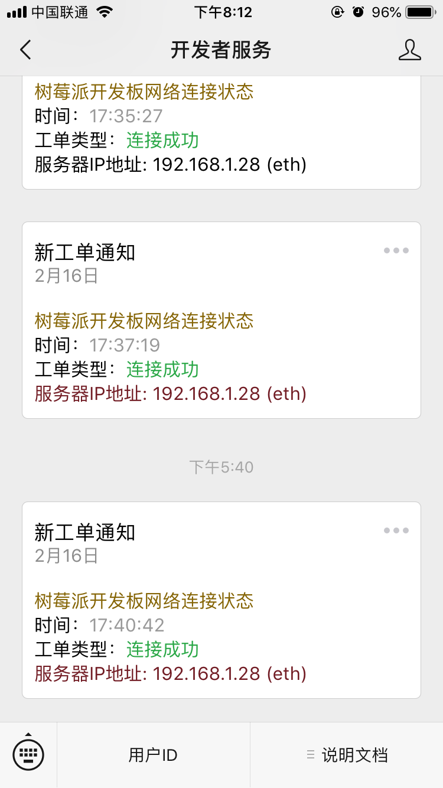

# Raspberry-ip-wechat

通常我们使用树莓派做小主机时往往是不需要连接屏幕的，在开发树莓派时如果没有屏幕的话首先需要知道主机的 IP 才能访问树莓派。一般情况下我们不需要知道，直接可以通过 `ssh pi@raspberrypi.local` 来连接主机，但是有些设备没有装 avahi 是不支持 `raspberrypi.local` 域名访问的，还要回归本质老老实实使用 IP，这时候我们每次访问树莓派都要一些步骤去获取 IP，整个过程可能将变得麻烦。我看网上也有一些比如发邮件的解决方案，实际情况大家用微信的频率要远远高于邮箱，这个项目可以让树莓派联网后自动发送本机 IP 到微信，相比邮箱可以减少微信切邮箱...邮箱切微信的动作。安装本项目后可以节约我们的一些时间成本，还可以增加一些开发乐趣。




### 前提

作者使用的是 [Raspbian Stretch Lite](https://www.raspberrypi.org/downloads/raspbian/) 版本的系统，以下所用的命令都基于这个系统上跑的，不同系统可能有一些差别，如果出现了问题欢迎提 [Issues](https://github.com/sanonz/raspberry-ip-wechat/issues) 一起探讨。

因为这个项目用了 nodejs，所以需要先安装才能使用，如果安装过了可以跳过
```bash
curl -sL https://deb.nodesource.com/setup_11.x | sudo -E bash -
sudo apt-get install -y nodejs
```

安装后执行以下命令查看是否成功，有版本输入则代表安装成功
```bash
$ node -v
v11.9.0
```

### 安装

Git 方式安装

```bash
$ git clone https://github.com/sanonz/raspberry-ip-wechat.git
$ cd raspberry-ip-wechat
$ pwd
```

或者 [直接下载](https://github.com/sanonz/raspberry-ip-wechat/archive/master.zip) 压缩包然后解压


### 升级

``` bash
$ cd raspberry-ip-wechat
$ git pull
```

### 配置

修改 `template.json` 配置文件

```json
{
  "userIds": ["o_bBF50Ewg8VYpIRJLYuo305d7EY"],
  "template_id": "4YscLc2uaCnsdrEdUJ9HGAGAkdBcEQM9bUBy0gs69Hw",
  "url": "",
  "data": {
    "first": {
      "value": "树莓派开发板网络连接状态",
      "color": "#333333"
    },
    "keyword1": {
      "value": "发送日期",
      "color": "#999999"
    },
    "keyword2": {
      "value": "连接成功",
      "color": "#28a745"
    },
    "remark": {
      "value": "服务器IP地址: {ip} ({type})",
      "color": "#333333"
    }
  }
}
```

- **userIds** - 接收者的微信 OpenID，微信搜索公众号 `wxpusher` 关注后把自动推送的 userId 填写到这里。
- **template_id** - 模板 ID，无需理会。
- **url** - 如果填写推送消息则可以点击，为空则不能点击。
- **data** - 推送的详细信息，`value` 与 `color` 字段都可以更改。支持模板，{ip} 会被替换成主机的 IP，{type} 会被替换成是 wifi/还是网线连接的。

添加开机启动脚本

```bash
$ sudo nano /etc/rc.local
#!/bin/sh -e
#
# rc.local
#
# This script is executed at the end of each multiuser runlevel.
# Make sure that the script will "exit 0" on success or any other
# value on error.
#
# In order to enable or disable this script just change the execution
# bits.
#
# By default this script does nothing.

# Print the IP address
_IP=$(hostname -I) || true
if [ "$_IP" ]; then
  printf "My IP address is %s\n" "$_IP"
fi

node /home/htdocs/dynimac/index.js # 增加这一行，放在 `exit 0` 前边

exit 0
```

添加完成后按 `ctrl+X` 然后按 `Y` 保存修改

然后赶紧重启你的树莓派试下吧，如果不出什么问题的话，你将收到一条树莓派给你发的微信。


### 小结

这个项目用了微信企业号的模板消息，申请需要提供公司资料认证，对于个人而言门槛还是比较高，所以本项目用了第三方提供的接口进行推送，稳定性及安全性不能保证，如果要求比较高请自行研究替换为自己的企业号。
